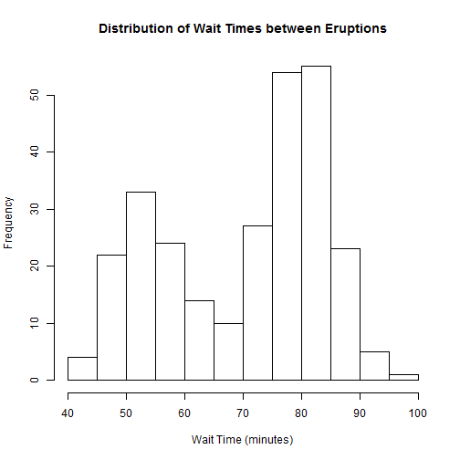
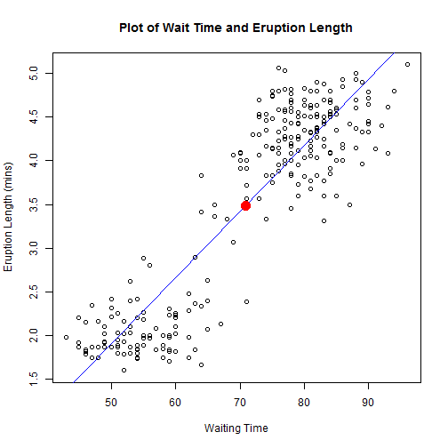
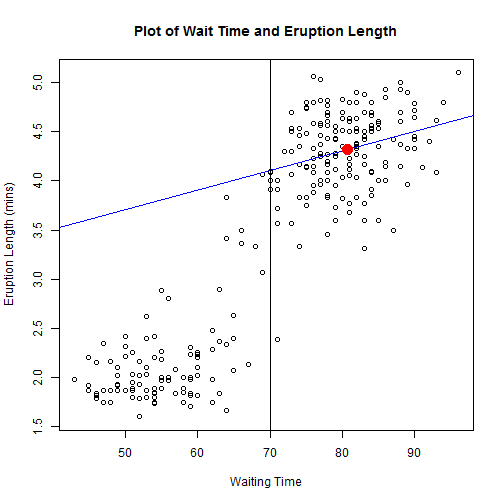

Old Faithful Geyser Waiting Time Estimator
========================================================
author: Adam
date: 3/28/2016
autosize: true

Objective
========================================================

Although Old Faithful is known as a very reliable geyser, there is still variability in eruption waiting times.
We have created an application that will estimate the remaining wait time and eruption length for a given wait time.

```
   eruptions        waiting    
 Min.   :1.600   Min.   :43.0  
 1st Qu.:2.163   1st Qu.:58.0  
 Median :4.000   Median :76.0  
 Mean   :3.488   Mean   :70.9  
 3rd Qu.:4.454   3rd Qu.:82.0  
 Max.   :5.100   Max.   :96.0  
```


Distribution of Wait Times
========================================================


***
As you can see, Old 'Faithful' is not all that faithful. Wait times appear to have a bimodal distribution with local modes at about 53 and 80 minutes.

Wait Times and Eruption Length
========================================================


***
The blue line is the least squares estimate of eruption length for a given waiting time. The red dot is the expected value of waiting time and eruption length.

The average wait time is 70.9 minutes, and the average duration of an eruption is 3.5 minutes.

Conditional Expected Wait Times and Eruption Length
========================================================

***
<small>This visual assumes a person has waited 70 minutes without an eruption. The visual contains the same information, but the regression line and expectation are based off the conditional expectation. The application also calculates the likelihood of an eruption occuring within the next five minutes.</small>
<small>Assuming you have already waited 70 minutes: the average remaining wait time is 10.7 minutes, the average eruptions lasts 4.3 minutes, and the likelihood of an eruption in the next 5 minutes is 16.4%.</small>
